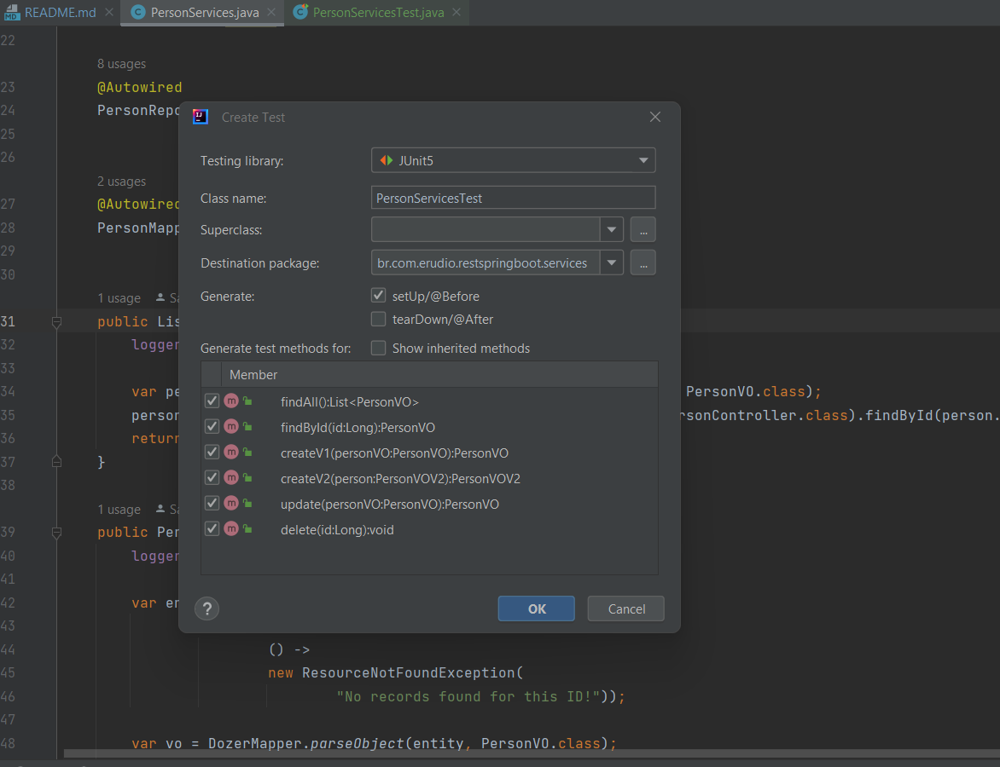

## _Seção 14 - HATEOAS:_ 
### Definição: 
* Considerado o último "estágio" para que uma aplicação seja considerada RESTful, o HATEOAS é uma constraint arquitetural que habilita na aplicação o recurso de navegação entre seus diversos recursos, melhorando a Experiência do Usuário.
```
Hypermedia as the Engine of Application State (HATEOAS) is a constraint of the REST 
 application architecture that distinguishes it from other network application architectures.

With HATEOAS, a client interacts with a network application whose application servers
 provide information dynamically through hypermedia. A REST client needs little 
 to no prior knowledge about how to interact with an application or server beyond a 
 generic understanding of hypermedia.

By contrast, clients and servers in Common Object Request Broker Architecture (CORBA)
 interact through a fixed interface shared through documentation or an interface 
 description language (IDL).

The restrictions imposed by HATEOAS decouple client and server. 
 This enables server functionality to evolve independently.
```
* Fonte: https://en.wikipedia.org/wiki/HATEOAS


#### Configurar a dependência
```
        <dependency>
            <groupId>org.springframework.hateoas</groupId>
            <artifactId>spring-hateoas</artifactId>
        </dependency>
```

#### Adaptar o VO (DTO) PersonVO para suportar Hateoas
* Estender RepresentationModel<PersonVO> e alterar a propriedade id para key (ou qualquer outra coisa), para não conflitar com o id que já existe em RepresentationModel
* Ajustar o construtor, getters e setters e equals & hashCode
```
@JsonPropertyOrder({"id", "first_name", "last_name", "address", "gender"})
public class PersonVO extends RepresentationModel<PersonVO> implements Serializable {
    // Alterado de id para key, pois o RepresentionModel já possui um id
    private Long key;
    
    {... construtor ...}
    
     public Long getKey() {
        return key;
    }

    public void setKey(Long key) {
        this.key = key;
    }
```

#### Ajustar a classe de serviço para utilizar o novo atributo (key)
* Todas as referências para id devem ser passadas para key

```
var entity = repository.findById(personVO.getKey())
    .orElseThrow(() -> new ResourceNotFoundException("No records found for this ID!"));
```

#### Ajustar os testes (se houver)
* trocar getId por getKey() e setId por setKey()
```
// Classe de testes
public void parseEntityListToVOListTest() {
        List<PersonVO> outputList = DozerMapper.parseListObjects(inputObject.mockEntityList(), PersonVO.class);
        PersonVO outputZero = outputList.get(0);

        assertEquals(Long.valueOf(0L), outputZero.getKey());
...

// Classe de mocks
public PersonVO mockVO(Integer number) {
        PersonVO person = new PersonVO();
        person.setAddress("Addres Test" + number);
        person.setFirstName("First Name Test" + number);
        person.setGender(((number % 2)==0) ? "Male" : "Female");
        person.setKey(number.longValue());
```

#### Ajustar o dozerMapper para fazer o parse de key como id
* trocar getId por getKey() e setId por setKey()
```
    // Essa anotation é de: import com.github.dozermapper.core.Mapping;
    ...
    public class PersonVO extends RepresentationModel<PersonVO> implements Serializable {
    @Mapping("id")
    private Long key;
```

#### Implementar de fato o hateoas em PersonServices
* Inicialmente faremos apenas para o método findById
* Para isso devemos inserir o link hateos no VO, após o mapping, antes de retorná-la.
```
// Adicionar imports estáticos em PersonServices
import static org.springframework.hateoas.server.mvc.WebMvcLinkBuilder.linkTo;
import static org.springframework.hateoas.server.mvc.WebMvcLinkBuilder.methodOn;

// Alterar findById. Incluir link hateoas no VO de retorno.
...
        PersonVO vo = DozerMapper.parseObject(entity, PersonVO.class);
        vo.add(linkTo(methodOn(PersonController.class).findById(id)).withSelfRel());
        return vo;
```

#### Implementar hateoas nos demais serviços: create, update, delete etc.
```
    // create
    public PersonVO createV1(PersonVO personVO) {
        logger.info("Creating one person!");

        var entity = DozerMapper.parseObject(personVO, Person.class);
        var vo = DozerMapper.parseObject(repository.save(entity), PersonVO.class);
        // Alterar de id para vo.getKey()
        vo.add(linkTo(methodOn(PersonController.class).findById(vo.getKey())).withSelfRel());
        return vo;
    }
    
    // update... (mesma alteração)
    vo.add(linkTo(methodOn(PersonController.class).findById(vo.getKey())).withSelfRel());
    
    // findAll...
    public List<PersonVO> findAll(){
        logger.info("Finding all people...");

        var persons = DozerMapper.parseListObjects(repository.findAll(), PersonVO.class);
        // Adicionar link hateoas para cada person da lista persons
        persons.stream().forEach(person -> person.add(linkTo(methodOn(PersonController.class).findById(person.getKey())).withSelfRel()));
        return persons;
    }
    
    // Ajustar também o VO para retornar id e não key
    @JsonPropertyOrder({"id", "first_name", "last_name", "address", "gender"})
    public class PersonVO extends RepresentationModel<PersonVO> implements Serializable {
        // Inserir a anotation @JsonProperty("id")
        @Mapping("id")
        @JsonProperty("id")
        private Long key;
    
```
* O método delete não precisa de implementação HATEOAS, porque ele não tem retorno.
* Atenção: lembrar de inserir a annotation @JsonProperty("id") para que o retorno seja de id e não de key.

## Introdução ao Mockito
É um framework de testes e spy. Seu principal objetio é simular a instância de classes e a implementação de métodos.
* Adicionar a dependência:
```
        <dependency>
            <groupId>org.mockito</groupId>
            <artifactId>mockito-core</artifactId>
            <scope>test</scope>
        </dependency>
```

### Implementar testes automatizados para validar a criação dos links hateoas.
* Atenção: para gerar a classe e os métodos de teste, temos que abrir a classe que será testada, no nosso caso PersonServices, clicar com o botão direito sobre um dos métodos, escolher a opção generate >> tests.
* Em seguida, manter a Testing Library em JUNit5 (versão jupiter), selecinar a opção setUp/@Before, marcar todos os métodos que serão testados e clicar em [OK]


* Mover a classe criada para o pacote unittests.mockito.services

### Implementação do primeiro teste unitário: findById
```
    @Test
    void findById() {
        // Já iniciamos o mock com número 1
        Person person = input.mockEntity(1);

        // Temos que setar um id, pois o mock não tem
        person.setId(1L);

        // Adicionar o: import static org.mockito.Mockito.when;
        // Criar um mock para quando o repository for chamado, retornar um mock
        // Para isso, mockar o repository nessa classe:
        // @Mock
        // PersonRepository repository;
        when(repository.findById(1L)).thenReturn(Optional.of(person));
        // Observar que o resultado aqui será o "person" que nós mockamos aqui nesse método findById

        var result = services.findById(1L);

        // Verificações

        assertNotNull(result);
        assertNotNull(result.getKey());
        assertNotNull(result.getLinks());
        // Usar o System.out para mostrar o resultado. Copiar e colar no assertTrue
        // System.out.println(result.toString());
        assertTrue(result.toString().contains("links: [</api/person/v1/1>;rel=\"self\"]"));
        // Recuperar esses valores de MockPerson.java
        assertEquals("Addres Test1", result.getAddress());
        assertEquals("First Name Test1", result.getFirstName());
        assertEquals("Last Name Test1", result.getLastName());
        // Female, pois o id 1 é impar
        assertEquals("Female", result.getGender());
    }
```